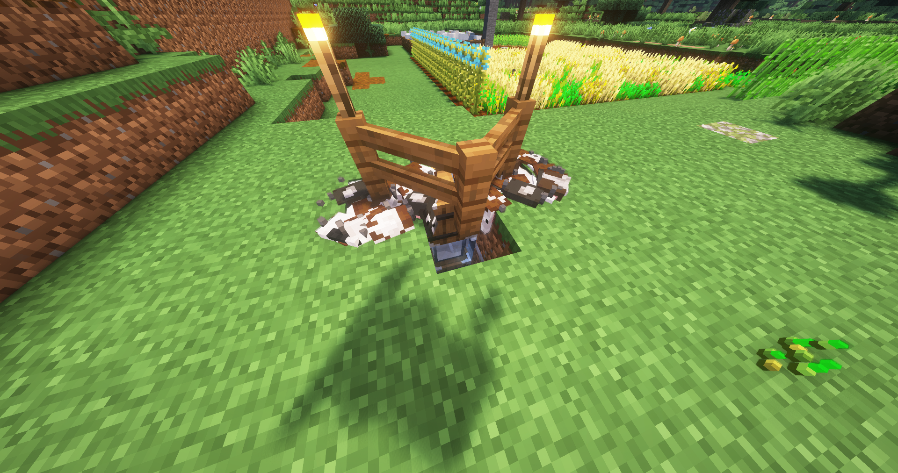
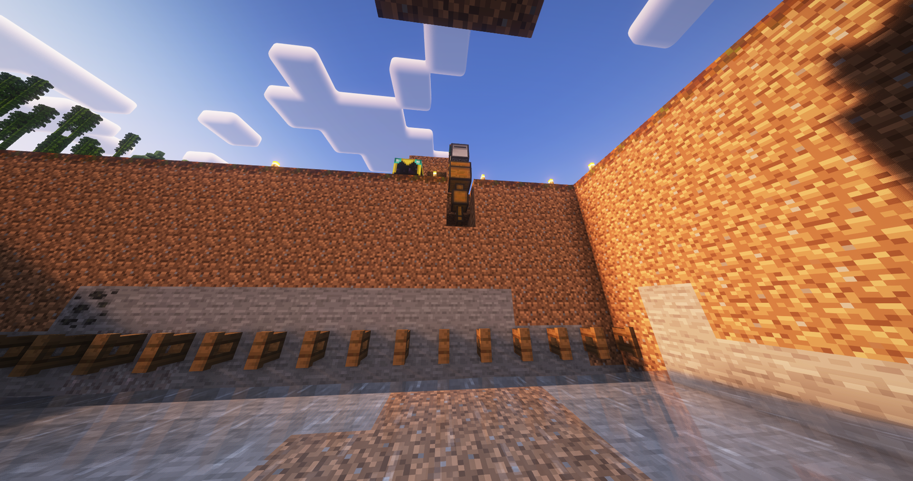

# What is this?
- A collection of turtle scripts for Minecraft
- Designed for vanilla, but played on a vanilla++ server
- Read each script for more detail and how to run them

# 3xcavate.lua
- A mod of the orirignal `excavate` command
- It assumes you have placed the turtle in front of a chest, so the chest is behind the turtle
- Then it turns around and tries to refuel using items in the chest (I put 4 stacks of charcoal blocks in the chest)
- Then it dumps all items
- Then it starts the regular `excavate` command except it digs up, forward and down
- It returns to the chest to drop off items
- It stops at the chest if it runs out of fuel

# cobble-farm.lua
- Farms cobble and stores it in a chest
- Uses no fuel and runs forever
- Works great with a compacting chest
- Produces 3k+ cobble per hour
- Literally just digs up and deposits down

# cow-farm.lua
- Combine with the Cow Crusher 9000
- Inifinitely breeds 48 cows using wheat every 5 mins
- Wheat is recharged from the above chest
- 

# nether-wart-farm.lua
- Checks if the nether wart has grown, then harvests and replants if it has

# stupid-farm.lua
- Breaks the block in front
- Useful for tiny sugarcane or bamboo farms

# tree-farm.lua
- Farms a 4x4 grid of 2x2 spruce trees (16 trees total)
- Produces around 5000 wood per hour
- The below image shows the farm from the perspective of the bottom left corner (note the chunk loader for the farm)
- The chest needs to be full of saplings so the turtle can collect them
- The sides are 4 blocks wide with 2 blocks between each dirt platform
- 
- The below image shows the storage hopper exporter from Tom's Simple Storage exporting saplings from my system into the chest
- The bottom water stream just collects into a chest - you can sort as you like from there
- 

# wheat-farm.lua
- WIP
